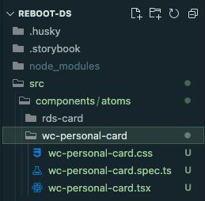

# Reboot Design System Web Component Collection

A collection of standard web components part of the Reboot Design System. 

The purpose of this package is to explore a efficient way to build micro front-ends using a set of reusable building blocks.

The collection is currently in an early development stage. 

Contact angel.garcia@novasolutionsystems.com to know more about the package and the develoment process.

## Getting Started

Clone the project from the repository

```bash
git clone https://<PersonalAccessTokens>@github.com/miguelnova/reboot-ds.git
```


Change directory

```bash
cd reboot-ds 
```

Donwload package:

```bash
npm i 
```

To integrate the Reboot Design System Web Component Collection (or RDS) package:

```bash
npm i reboot-ds
```

Run the project

```bash
npm start
```

## New component

Create a new web component:

```bash
stencil generate wc-personal-card
```

```bash
src
 |- components
     |- atoms
         |- wc-personal-card
             |- wc-personal-card.css
             |- wc-personal-card.spec.ts
             |- wc-personal-card.tsx
```



## Save changes

Save changes commit

```bash
git add .
npm run commit
```
Types commits

```bash

types: {
      chore: {
        description: 'Build process or auxiliary tool changes',
        emoji: '🤖',
        value: 'chore'
      },
      ci: {
        description: 'CI related changes',
        emoji: '🎡',
        value: 'ci'
      },
      docs: {
        description: 'Documentation only changes',
        emoji: '✏️',
        value: 'docs'
      },
      feat: {
        description: 'A new feature',
        emoji: '🎸',
        value: 'feat'
      },
      fix: {
        description: 'A bug fix',
        emoji: '🐛',
        value: 'fix'
      },
      perf: {
        description: 'A code change that improves performance',
        emoji: '⚡️',
        value: 'perf'
      },
      refactor: {
        description: 'A code change that neither fixes a bug or adds a feature',
        emoji: '💡',
        value: 'refactor'
      },
      release: {
        description: 'Create a release commit',
        emoji: '🏹',
        value: 'release'
      },
      style: {
        description: 'Markup, white-space, formatting, missing semi-colons...',
        emoji: '💄',
        value: 'style'
      },
      test: {
        description: 'Adding missing tests',
        emoji: '💍',
        value: 'test'
      }
    }

```


### Run Scripts

Analyze static code with ESlint

```bash
npm run lint
```

Format code

```bash
npm run format
```

Run unit tests

```bash
npm run test
```

Build a project

```bash
npm run build
```